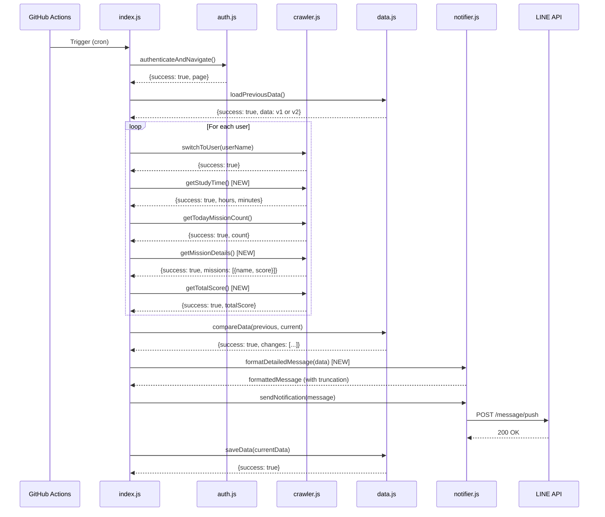
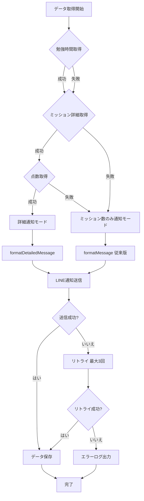
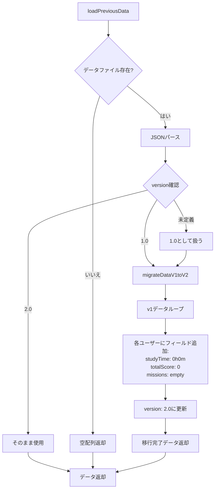

# Technical Design Document

**Feature**: line-notify-study-details

**Created**: 2025-12-30

**Status**: Design Phase

---

## 1. Overview

### 1.1 Purpose

現在のスマイルゼミクローラーシステムを拡張し、LINE通知に「勉強時間」「ミッション名」「獲得点数」の詳細情報を追加します。これにより、保護者は子供の学習進捗をより具体的に把握でき、適切なサポートを提供できるようになります。

### 1.2 Users and Use Cases

**Primary Users**: 保護者

**Use Cases**:
- UC1: 保護者と子供本人が毎日LINEで子供の勉強時間を確認する
- UC2: 保護者と子供本人がどのミッションに取り組んでいるかを把握する
- UC3: 保護者が獲得点数から学習の質を評価する
- UC4: 保護者と子供本人が学習状況を一度に確認する

### 1.3 Impact and Benefits

**Benefits**:
- 保護者の学習状況把握精度が向上（ミッション数のみ → 時間・内容・成果の3次元）
- 子供への適切な声がけタイミングの把握が可能
- 学習傾向の早期発見（特定分野への集中、点数の変化など）

**Non-Functional Impact**:
- 実行時間: 現在の約2倍（ユーザーあたり15秒 → 30秒想定）
- データサイズ: 約5倍増加（1ユーザーあたり50バイト → 250バイト）
- LINE通知長: 現在の約3倍（100文字 → 300文字程度）

---

## 2. Goals and Non-Goals

### 2.1 Goals

- ✅ 勉強時間データの自動取得と通知
- ✅ ミッション詳細（名前・点数）の取得と表示（最大10件）
- ✅ 既存のミッション数通知機能との後方互換性
- ✅ データ構造のバージョン管理（v1.0 → v2.0）
- ✅ エラー時のグレースフルデグラデーション
- ✅ LINE API 5000文字制限への対応

### 2.2 Non-Goals

- ❌ 週次・月次のレポート機能（本機能は日次通知のみ）
- ❌ みまもるネット以外のデータソース対応
- ❌ ユーザー設定によるカスタマイズ機能
- ❌ データの可視化やグラフ表示
- ❌ プッシュ通知のタイミング変更

---

## 3. Architecture

### 3.1 Existing System Analysis

**Current Architecture** (from research.md):

```
┌─────────────┐
│ index.js    │ - エントリーポイント、全体フロー制御
└──────┬──────┘
       │
       ├──→ ┌─────────────┐
       │    │ auth.js     │ - みまもるネット認証
       │    └─────────────┘
       │
       ├──→ ┌─────────────┐
       │    │ crawler.js  │ - データ取得（ミッション数のみ）
       │    └─────────────┘
       │
       ├──→ ┌─────────────┐
       │    │ data.js     │ - データ保存・比較
       │    └─────────────┘
       │
       └──→ ┌─────────────┐
            │ notifier.js │ - LINE通知送信
            └─────────────┘
```

**Key Patterns**:
- 単一責任原則に基づくモジュール分離
- 統一的なエラーハンドリング: `{success: boolean, error?: string}`
- リトライロジック: 指数バックオフ with jitter
- セキュリティ: `maskSensitiveData()` による自動マスキング

### 3.2 Extended Architecture Pattern

**Option A: 既存コンポーネント拡張** (Selected - see research.md Decision 1)

```
┌─────────────┐
│ index.js    │ - 変更なし
└──────┬──────┘
       │
       ├──→ ┌─────────────────────────────────────┐
       │    │ auth.js                            │ - 変更なし
       │    └─────────────────────────────────────┘
       │
       ├──→ ┌─────────────────────────────────────┐
       │    │ crawler.js                         │ - 拡張
       │    │  - getTodayMissionCount() (既存)   │
       │    │  + getStudyTime()         (新規)   │
       │    │  + getMissionDetails()    (新規)   │
       │    │  + getTotalScore()        (新規)   │
       │    └─────────────────────────────────────┘
       │
       ├──→ ┌─────────────────────────────────────┐
       │    │ data.js                            │ - 拡張
       │    │  - loadPreviousData() (既存)       │
       │    │  - compareData()      (既存)       │
       │    │  - saveData()         (既存)       │
       │    │  + migrateDataV1toV2() (新規)      │
       │    └─────────────────────────────────────┘
       │
       └──→ ┌─────────────────────────────────────┐
            │ notifier.js                        │ - 拡張
            │  - sendNotification()    (既存)    │
            │  - formatMessage()       (既存)    │
            │  + formatDetailedMessage() (新規)  │
            │  + truncateToLimit()       (新規)  │
            └─────────────────────────────────────┘

       新規 → ┌─────────────────────────────────────┐
              │ config/selectors.js                │ - 新規作成
              │  + STUDY_TIME_SELECTOR             │
              │  + MISSION_NAME_SELECTOR           │
              │  + MISSION_SCORE_SELECTOR          │
              └─────────────────────────────────────┘

       調査 → ┌─────────────────────────────────────┐
              │ scripts/investigate-study-details.js│ - 新規作成
              │  - DOM構造調査スクリプト              │
              └─────────────────────────────────────┘
```

**Rationale**:
- プロジェクトスケールに適している（単一機能システム）
- 既存パターンとの一貫性が高い
- ファイル数を増やさず、シンプルな構造を維持
- 各モジュールの責務は明確に保たれる

### 3.3 Technology Stack

**No Changes** - 既存技術スタックを継続使用:

| Component | Technology | Version | Notes |
|-----------|-----------|---------|-------|
| Runtime | Node.js | 18+ | GitHub Actions環境 |
| Automation | Playwright | v1.57.0 | ブラウザ自動化 |
| Notification | LINE Messaging API | v2 | Push Message API |
| Data Format | JSON | - | ファイルベース永続化 |
| Scheduling | GitHub Actions | - | cron: "0 2 * * *" (JST 11:00) |
| Container | Docker | - | playwright:v1.57.0-jammy |
| Module System | CommonJS | - | require/module.exports |

---

## 4. System Flows

### 4.1 Main Execution Flow



### 4.2 Error Fallback Flow



### 4.3 Data Migration Flow



---

## 5. Requirements Traceability

| Requirement ID | Component | Function/Module | Notes |
|----------------|-----------|-----------------|-------|
| **Req 1**: 勉強時間データの取得 | crawler.js | `getStudyTime()` | DOM調査後に実装 |
| 1.1: 当日の勉強時間取得 | crawler.js | `getStudyTime()` | セレクタ: `STUDY_TIME_SELECTOR` |
| 1.2: 時間と分の単位で抽出 | crawler.js | `getStudyTime()` | 正規表現: `/(\d+)時間(\d+)分/` |
| 1.3: データ不在時0h0m | crawler.js | `getStudyTime()` | デフォルト値処理 |
| 1.4: 構造化形式で保存 | data.js | `saveData()` | `{hours: number, minutes: number}` |
| **Req 2**: ミッション詳細データの取得 | crawler.js | `getMissionDetails()` | DOM調査後に実装 |
| 2.1: 完了ミッション一覧取得 | crawler.js | `getMissionDetails()` | 位置ベース検索 |
| 2.2: 名前と点数の抽出 | crawler.js | `getMissionDetails()` | セレクタ: `MISSION_NAME_SELECTOR`, `MISSION_SCORE_SELECTOR` |
| 2.3: 名前取得失敗時デフォルト | crawler.js | `getMissionDetails()` | デフォルト: "ミッション" |
| 2.4: 最大10件まで取得 | crawler.js | `getMissionDetails()` | `missions.slice(0, 10)` |
| 2.5: 10件超過時最新10件 | crawler.js | `getMissionDetails()` | 配列操作 |
| **Req 3**: 点数データの取得 | crawler.js | `getTotalScore()`, `getMissionDetails()` | 2つの関数で対応 |
| 3.1: 獲得点数抽出 | crawler.js | `getMissionDetails()` | 各ミッションの点数 |
| 3.2: 数値形式で保存 | data.js | `saveData()` | `parseInt()` |
| 3.3: 点数不在時0点 | crawler.js | `getMissionDetails()` | デフォルト値処理 |
| 3.4: 合計点数計算 | crawler.js | `getTotalScore()` | `missions.reduce((sum, m) => sum + m.score, 0)` |
| **Req 4**: LINE通知内容の拡張 | notifier.js | `formatDetailedMessage()` | 新規フォーマット関数 |
| 4.1: データ取得完了時詳細送信 | index.js | Main flow | オーケストレーション |
| 4.2: 詳細情報含むメッセージ | notifier.js | `formatDetailedMessage()` | ユーザー名、時間、数、点数、詳細 |
| 4.3: リスト形式で表示 | notifier.js | `formatDetailedMessage()` | `・${name}: ${score}点` |
| 4.4: 複数ユーザー分割表示 | notifier.js | `formatDetailedMessage()` | ユーザーごとにセクション |
| 4.5: 5000文字制限制御 | notifier.js | `truncateToLimit()` | 文字数カウント+切り詰め |
| **Req 5**: データ保存と履歴管理 | data.js | 拡張 | データ構造v2.0対応 |
| 5.1: JSON保存 | data.js | `saveData()` | 既存関数の拡張 |
| 5.2: 変更検出 | data.js | `compareData()` | 既存関数の拡張（詳細比較） |
| 5.3: 新規ミッション強調 | notifier.js | `formatDetailedMessage()` | 差分表示ロジック |
| 5.4: タイムスタンプ含む | data.js | `saveData()` | 既存機能 |
| 5.5: 過去7日分保持 | data.js | `cleanupOldData()` | 新規関数（オプショナル） |
| **Req 6**: エラーハンドリング | 全モジュール | エラー処理 | 統一パターン適用 |
| 6.1: 勉強時間失敗時スキップ | crawler.js | `getStudyTime()` | try-catch + default値 |
| 6.2: ミッション詳細失敗でフォールバック | index.js | Main flow | 条件分岐 |
| 6.3: 部分データのみ通知 | notifier.js | `formatDetailedMessage()` | 利用可能データのみ表示 |
| 6.4: エラー情報含む | notifier.js | Error handling | エラーメッセージ追加 |
| 6.5: 保存失敗時継続 | data.js | `saveData()` | エラーログ出力 |
| **Req 7**: パフォーマンスと制約 | 全モジュール | - | タイムアウト設定 |
| 7.1: 30秒/ユーザー以内 | crawler.js | All functions | タイムアウト設定 |
| 7.2: 全体5分以内 | index.js | Main flow | タイムアウト監視 |
| 7.3: API呼び出し最大3回 | notifier.js | `sendNotification()` | 既存のリトライロジック |
| 7.4: 最小ナビゲーション | crawler.js | All functions | ページ遷移最小化 |

---

## 6. Components and Interfaces

### 6.1 crawler.js - 拡張

#### 6.1.1 getStudyTime()

**Purpose**: 当日の勉強時間を取得

**Signature**:
```javascript
/**
 * 当日の勉強時間を取得
 * @param {Page} page - Playwrightページオブジェクト
 * @returns {Promise<{success: boolean, hours?: number, minutes?: number, error?: string}>}
 */
async function getStudyTime(page)
```

**Algorithm**:
1. `STUDY_TIME_SELECTOR`を使用して勉強時間要素を検索
2. テキスト内容を以下の正規表現パターンでパース:
   - `/(\d+)時間(\d+)分/` - "X時間Y分"形式
   - `/(\d+)分/` - "Y分"のみ形式（新規追加）
   - `/(\d+)時間/` - "X時間"のみ形式
3. 成功時: `{success: true, hours, minutes}`を返却
4. 失敗時: `{success: true, hours: 0, minutes: 0}`（デフォルト値）
5. エラー時: `{success: false, error: "エラーメッセージ"}`

**Note**: "5分"のような分のみの表示に対応するため、柔軟なパターンマッチングを実装

**Error Handling**:
- DOM要素不在: デフォルト値（0時間0分）
- パース失敗: デフォルト値
- Playwright例外: エラーレスポンス

**Performance**:
- タイムアウト: 5秒
- リトライ: なし（失敗時デフォルト値）

#### 6.1.2 getMissionDetails()

**Purpose**: 完了ミッションの詳細（名前・点数）を取得

**Signature**:
```javascript
/**
 * 完了ミッションの詳細を取得
 * @param {Page} page - Playwrightページオブジェクト
 * @returns {Promise<{success: boolean, missions?: Array<{name: string, score: number, completed: boolean}>, error?: string}>}
 */
async function getMissionDetails(page)
```

**Algorithm**:
1. 今日のセクションを特定（既存の`getTodayMissionCount()`と同様の位置ベース検索）
2. 完了済みミッションアイコン（`.missionIcon__i6nW8`）を列挙
3. 各ミッションについて:
   a. 親要素（parent）を取得
   b. 祖父母要素（grandparent）を取得: `parent.locator('..')`
   c. `MISSION_NAME_SELECTOR`（`.title__C3bzF`）を**grandparent内**で検索
   d. `MISSION_SCORE_SELECTOR`（`.scoreLabel__LpVbL`）を**grandparent/greatGrandparent内**で検索
   e. NEWラベル有無で完了判定（既存ロジック）
4. 最大10件に制限: `missions.slice(0, 10)`
5. 成功時: `{success: true, missions: [...]}`
6. エラー時: `{success: false, error: "エラーメッセージ"}`

**DOM Hierarchy Fix**:
- ミッション名と点数は`.missionIcon__i6nW8`の親要素の**兄弟要素**として配置されている
- したがって、grandparent（祖父母）レベルでの検索が必要

**Data Structure**:
```javascript
{
  name: "算数の問題",      // デフォルト: "ミッション"
  score: 85,              // デフォルト: 0
  completed: true         // NEWラベルなし = true
}
```

**Error Handling**:
- 名前取得失敗: デフォルト名"ミッション"
- 点数取得失敗: 0点
- 全体失敗: 空配列返却

**Performance**:
- タイムアウト: 10秒
- 最大10件制限で処理時間を抑制

#### 6.1.3 getTotalScore()

**Purpose**: 当日の合計点数を計算

**Signature**:
```javascript
/**
 * 当日の合計点数を計算
 * @param {Array<{name: string, score: number, completed: boolean}>} missions - ミッション詳細配列
 * @returns {number} 合計点数
 */
function getTotalScore(missions)
```

**Algorithm**:
```javascript
return missions.reduce((sum, mission) => sum + mission.score, 0);
```

**Notes**:
- Pure function（副作用なし）
- `getMissionDetails()`の結果を使用
- エラーハンドリング不要（入力配列保証）

### 6.2 notifier.js - 拡張

#### 6.2.1 formatDetailedMessage()

**Purpose**: 詳細情報を含むLINE通知メッセージをフォーマット

**Signature**:
```javascript
/**
 * 詳細情報を含むLINE通知メッセージをフォーマット
 * @param {Array<{userName: string, studyTime: {hours: number, minutes: number}, missionCount: number, totalScore: number, missions: Array}>} userData - ユーザーデータ配列
 * @param {Array} previousData - 前回データ配列（点数比較用、オプショナル）
 * @returns {string} フォーマット済みメッセージ
 */
function formatDetailedMessage(userData, previousData = [])
```

**Message Format**:
```
📊 スマイルゼミ 学習状況

👤 {ユーザー名}
⏱️ 勉強時間: {時間}:{分}
✅ 完了ミッション: {完了数}件

📋 ミッション詳細:
  ・{ミッション名}: {点数}点
  ・{ミッション名}: {前回点数}→{現在点数}点
  ...

👤 {ユーザー名2}
...
```

**Format Changes** (実装中の改善):
- 勉強時間: "X時間Y分" → "H:MM" (例: "0時間5分" → "0:05")
- 合計点数: 削除（データには保持されるが通知には含めない）
- 点数比較: 前回データがあり点数が変化している場合のみ"80→95点"と表示

**Algorithm**:
1. ヘッダー追加: "📊 スマイルゼミ 学習状況\n\n"
2. 各ユーザーについて:
   a. ユーザー情報セクション作成（名前、勉強時間"H:MM"形式、完了ミッション数）
   b. ミッション詳細リスト追加（最大10件）
      - 前回データがあり点数が変化している場合: "{前回}→{現在}点"
      - それ以外: "{点数}点"
   c. セクション区切り追加
3. `truncateToLimit(message, 5000)`で文字数制限
4. 完成メッセージ返却

**Score Comparison Logic**:
- 前回データから同名ミッション+同じ完了状態を優先マッチング
- マッチしない場合は同名ミッションのみでマッチング
- 点数が異なる場合のみ"80→95点"と表示、同じ場合は"95点"のみ

**Error Handling**:
- データ不在フィールド: デフォルト値表示（0時間0分、0点など）
- ミッション配列空: "ミッション詳細なし"

#### 6.2.2 truncateToLimit()

**Purpose**: メッセージを指定文字数以内に切り詰め

**Signature**:
```javascript
/**
 * メッセージを指定文字数以内に切り詰め
 * @param {string} message - 元のメッセージ
 * @param {number} limit - 文字数上限（デフォルト: 5000）
 * @returns {string} 切り詰め後のメッセージ
 */
function truncateToLimit(message, limit = 5000)
```

**Algorithm**:
1. 文字数カウント: `message.length`
2. `limit`以下なら: そのまま返却
3. 超過時:
   a. `message.substring(0, limit - 50)`で切り詰め
   b. "\n\n...（メッセージが長すぎるため省略）"を追加
   c. 返却

**Notes**:
- LINE API制限: 5000文字
- 安全マージン: 50文字

### 6.3 data.js - 拡張

#### 6.3.1 loadPreviousData() - 拡張

**Purpose**: 前回データ読み込み + v1.0→v2.0自動移行

**Signature**:
```javascript
/**
 * 前回実行時のデータを読み込む（バージョン移行対応）
 * @returns {Promise<{success: boolean, data?: Array, error?: string}>}
 */
async function loadPreviousData()
```

**Extended Algorithm**:
```javascript
// 既存処理
const jsonData = JSON.parse(fileContent);
const version = jsonData.version || '1.0';

// 新規追加: バージョン判定
if (version === '1.0') {
  const migratedData = migrateDataV1toV2(jsonData.users);
  return { success: true, data: migratedData };
} else if (version === '2.0') {
  return { success: true, data: jsonData.users };
} else {
  return { success: false, error: `Unknown version: ${version}` };
}
```

#### 6.3.2 migrateDataV1toV2() - 新規

**Purpose**: データ構造v1.0をv2.0に移行

**Signature**:
```javascript
/**
 * データ構造v1.0をv2.0に移行
 * @param {Array<{userName: string, missionCount: number, date: string}>} v1Data - v1.0形式データ
 * @returns {Array<{userName: string, missionCount: number, date: string, studyTime: {hours: number, minutes: number}, totalScore: number, missions: Array}>} v2.0形式データ
 */
function migrateDataV1toV2(v1Data)
```

**Algorithm**:
```javascript
return v1Data.map(user => ({
  ...user,  // userName, missionCount, date を保持
  studyTime: { hours: 0, minutes: 0 },  // デフォルト値
  totalScore: 0,                         // デフォルト値
  missions: []                           // 空配列
}));
```

**Notes**:
- Pure function
- 非破壊的変換
- v1.0データ保持（後方互換性）

#### 6.3.3 saveData() - 拡張

**Purpose**: v2.0データ構造での保存

**Signature**: 既存と同じ

**Extended Algorithm**:
```javascript
const saveObject = {
  version: '2.0',  // v1.0 → v2.0 に変更
  timestamp: new Date().toISOString(),
  users: data
};
```

**Notes**:
- v2.0データ構造を期待
- versionフィールドを"2.0"に固定

#### 6.3.4 compareData() - 拡張（オプショナル）

**Purpose**: 詳細データの変更検出（将来拡張用）

**Current**: ミッション数のみ比較

**Future Enhancement** (Phase 2):
- 勉強時間の変化検出
- 新規完了ミッションの検出
- 点数の変化検出

**Note**: 初期実装ではミッション数比較のみ（既存ロジック維持）

### 6.4 config/selectors.js - 新規作成

**Purpose**: DOMセレクタの集中管理

**Structure**:
```javascript
/**
 * DOM要素セレクタ定義
 *
 * NOTE: これらのセレクタは scripts/investigate-study-details.js で
 * 実際のDOM構造を調査した後に確定する。
 * 以下は想定される構造に基づく暫定値。
 */

module.exports = {
  // 勉強時間セレクタ（調査後確定）
  STUDY_TIME_SELECTOR: '.study-time-display',  // 暫定

  // ミッション名セレクタ（調査後確定）
  MISSION_NAME_SELECTOR: '.mission-title',     // 暫定

  // ミッション点数セレクタ（調査後確定）
  MISSION_SCORE_SELECTOR: '.mission-score',    // 暫定

  // 既存セレクタ（参考）
  MISSION_ICON_SELECTOR: '.missionIcon__i6nW8',
  NEW_LABEL_SELECTOR: 'text=NEW'
};
```

**Notes**:
- 実際のセレクタは DOM調査スクリプト実行後に更新
- CSSクラス名の変更に対する単一変更点

### 6.5 scripts/investigate-study-details.js - 新規作成

**Purpose**: みまもるネットのDOM構造調査

**Signature**:
```javascript
/**
 * DOM構造調査スクリプト
 * 実行: node scripts/investigate-study-details.js
 */
```

**Algorithm**:
1. `auth.js`を使用してログイン
2. ユーザー切り替え（1人目）
3. 以下の要素を調査:
   a. 勉強時間表示エリア（テキスト内容、クラス名、位置）
   b. ミッション名要素（`.missionIcon__i6nW8`の親/兄弟要素）
   c. 点数表示要素（同上）
4. スクリーンショット保存（`screenshots/study-details-investigation.png`）
5. 調査結果をコンソール出力:
```
=== 勉強時間要素 ===
セレクタ: .study-time-display
テキスト: "2時間30分"
位置: x=100, y=200

=== ミッション名要素 ===
セレクタ: .mission-title
テキスト: "算数の問題"
親要素: .mission-card

=== 点数要素 ===
セレクタ: .mission-score
テキスト: "85点"
```

**Output**:
- コンソール出力（調査結果）
- スクリーンショット（視覚的確認用）

**Usage**:
```bash
node scripts/investigate-study-details.js
```

---

## 7. Data Models

### 7.1 Data Structure v2.0

**File**: `data/mission_data.json`

**Schema**:
```javascript
{
  "version": "2.0",
  "timestamp": "2025-12-30T12:00:00.000Z",
  "users": [
    {
      "userName": "山田太郎さん",
      "missionCount": 2,
      "date": "2025-12-30",
      "studyTime": {
        "hours": 2,
        "minutes": 30
      },
      "totalScore": 170,
      "missions": [
        {
          "name": "算数の問題",
          "score": 85,
          "completed": true
        },
        {
          "name": "国語の漢字",
          "score": 85,
          "completed": true
        }
      ]
    }
  ]
}
```

**Field Definitions**:

| Field | Type | Required | Description | Default |
|-------|------|----------|-------------|---------|
| `version` | string | Yes | データ構造バージョン | "2.0" |
| `timestamp` | string (ISO 8601) | Yes | 実行日時 | `new Date().toISOString()` |
| `users` | Array | Yes | ユーザーデータ配列 | `[]` |
| `users[].userName` | string | Yes | ユーザー名 | - |
| `users[].missionCount` | number | Yes | 完了ミッション数 | 0 |
| `users[].date` | string (YYYY-MM-DD) | Yes | データ取得日 | - |
| `users[].studyTime` | Object | Yes | 勉強時間 | `{hours: 0, minutes: 0}` |
| `users[].studyTime.hours` | number | Yes | 時間（整数） | 0 |
| `users[].studyTime.minutes` | number | Yes | 分（整数） | 0 |
| `users[].totalScore` | number | Yes | 合計点数 | 0 |
| `users[].missions` | Array | Yes | ミッション詳細配列 | `[]` |
| `users[].missions[].name` | string | Yes | ミッション名 | "ミッション" |
| `users[].missions[].score` | number | Yes | 獲得点数 | 0 |
| `users[].missions[].completed` | boolean | Yes | 完了フラグ | true |

**Constraints**:
- `missions`配列: 最大10件
- `studyTime.hours`: 0-24
- `studyTime.minutes`: 0-59
- `score`, `totalScore`: 0以上の整数

### 7.2 Data Migration Strategy

**v1.0 → v2.0 Migration**:

**Input (v1.0)**:
```json
{
  "version": "1.0",
  "timestamp": "2025-12-30T02:13:16.504Z",
  "users": [
    {
      "userName": "山田太郎さん",
      "missionCount": 2,
      "date": "2025-12-30"
    }
  ]
}
```

**Output (v2.0)**:
```json
{
  "version": "2.0",
  "timestamp": "2025-12-30T02:13:16.504Z",
  "users": [
    {
      "userName": "山田太郎さん",
      "missionCount": 2,
      "date": "2025-12-30",
      "studyTime": {
        "hours": 0,
        "minutes": 0
      },
      "totalScore": 0,
      "missions": []
    }
  ]
}
```

**Migration Rules**:
1. v1.0フィールドは全て保持（後方互換性）
2. 新規フィールドはデフォルト値で初期化
3. `version`フィールドは"2.0"に更新
4. `timestamp`は元の値を保持（移行時刻ではない）

**Rollback Strategy**:
- v2.0データからv1.0フィールドを抽出可能（非破壊的移行）
- ロールバック関数`migrateDataV2toV1()`の実装は不要（v1.0フィールド保持のため）

### 7.3 Comparison Data Structure

**Purpose**: データ変更検出用の内部構造（`compareData()`の戻り値）

**Schema**:
```javascript
{
  success: true,
  changes: [
    {
      userName: "山田太郎さん",
      previousCount: 1,
      currentCount: 2,
      diff: 1,
      type: "increase"  // "increase" | "decrease" | "new"
    }
  ]
}
```

**Notes**:
- 初期実装では`missionCount`のみ比較（既存ロジック）
- 将来拡張: `studyTime`, `totalScore`, `missions`の変更検出

---

## 8. Error Handling

### 8.1 Error Response Format

**Unified Format** (既存パターン継続):
```javascript
{
  success: false,
  error: "エラーメッセージ"
}
```

### 8.2 Error Scenarios and Handling

| Scenario | Component | Handling | Fallback | User Impact |
|----------|-----------|----------|----------|-------------|
| **勉強時間取得失敗** | crawler.js | `getStudyTime()` returns `{success: true, hours: 0, minutes: 0}` | デフォルト値（0h0m） | 勉強時間のみ0表示 |
| **ミッション詳細取得失敗** | crawler.js | `getMissionDetails()` returns `{success: true, missions: []}` | 空配列 | ミッション詳細なし、ミッション数のみ表示 |
| **点数取得失敗** | crawler.js | デフォルト値: `score: 0` | 0点 | 点数のみ0表示 |
| **全体データ取得失敗** | index.js | 条件分岐: `formatMessage()`使用（従来版） | ミッション数のみ通知 | 詳細なし、従来通り |
| **LINE API送信失敗** | notifier.js | リトライ（最大3回、指数バックオフ） | エラーログ出力 | 通知未送信、エラー記録 |
| **データ保存失敗** | data.js | エラーログ出力、処理継続 | - | 次回実行時に再取得 |
| **データ移行失敗** | data.js | エラーレスポンス返却 | 空配列 | 初回実行扱い |
| **5000文字超過** | notifier.js | `truncateToLimit()`で切り詰め | 切り詰め+注記 | 一部情報省略 |

### 8.3 Graceful Degradation Strategy

**Level 1: 詳細通知モード（理想状態）**
- 勉強時間 ✅
- ミッション数 ✅
- ミッション詳細 ✅
- 合計点数 ✅

**Level 2: 部分通知モード（一部失敗）**
- 勉強時間 ❌ → 0h0m表示
- ミッション数 ✅
- ミッション詳細 ✅ or ❌
- 合計点数 ✅ or ❌

**Level 3: 基本通知モード（フォールバック）**
- ミッション数のみ通知（既存の`formatMessage()`使用）
- 従来機能と同等

**Decision Logic** (index.js):
```javascript
const detailsAvailable =
  studyTimeResult.success ||
  missionDetailsResult.success ||
  totalScoreResult.success;

if (detailsAvailable) {
  message = formatDetailedMessage(userData);  // Level 1 or 2
} else {
  message = formatMessage(changes);           // Level 3
}
```

### 8.4 Error Logging

**Log Format**:
```javascript
console.error(`[${new Date().toISOString()}] ${component}.${function}: ${errorMessage}`);
```

**Examples**:
```
[2025-12-30T12:00:00.000Z] crawler.getStudyTime: セレクタ .study-time-display が見つかりません
[2025-12-30T12:00:05.000Z] notifier.sendNotification: LINE API呼び出し失敗 (retry 1/3)
[2025-12-30T12:00:10.000Z] data.saveData: ファイル書き込み失敗: EACCES
```

**Logged to**:
- GitHub Actions logs（標準エラー出力）
- LINE通知（重大なエラーのみ）

---

## 9. Testing Strategy

### 9.1 Unit Testing

**Scope**: Pure functions and business logic

**Target Functions**:
| Function | Test Cases | Priority |
|----------|-----------|----------|
| `getTotalScore()` | 空配列、1件、複数件、0点含む | High |
| `migrateDataV1toV2()` | 空配列、1ユーザー、複数ユーザー | High |
| `truncateToLimit()` | 制限以下、制限ちょうど、超過 | Medium |
| `formatDetailedMessage()` | 1ユーザー、複数ユーザー、データ欠損 | High |

**Framework**: Jest (新規導入) or 手動テスト

**Example**:
```javascript
// tests/data.test.js
const { migrateDataV1toV2 } = require('../src/data');

test('migrateDataV1toV2: 空配列', () => {
  const result = migrateDataV1toV2([]);
  expect(result).toEqual([]);
});

test('migrateDataV1toV2: 1ユーザー', () => {
  const input = [
    { userName: "太郎さん", missionCount: 2, date: "2025-12-30" }
  ];
  const expected = [
    {
      userName: "太郎さん",
      missionCount: 2,
      date: "2025-12-30",
      studyTime: { hours: 0, minutes: 0 },
      totalScore: 0,
      missions: []
    }
  ];
  expect(migrateDataV1toV2(input)).toEqual(expected);
});
```

### 9.2 Integration Testing

**Scope**: Component interactions

**Test Scenarios**:
1. **データフロー全体**:
   - 認証 → データ取得 → 保存 → 通知
   - Expected: 全モジュール連携成功
2. **エラーフォールバック**:
   - ミッション詳細取得失敗 → 基本通知モード
   - Expected: `formatMessage()`使用
3. **データ移行**:
   - v1.0データ読み込み → v2.0変換 → 保存
   - Expected: v2.0形式で保存

**Environment**: ローカルDocker環境

**Execution**:
```bash
docker-compose run --rm crawler node src/index.js
```

### 9.3 DOM Investigation Testing

**Purpose**: セレクタの正確性検証

**Process**:
1. `scripts/investigate-study-details.js`実行
2. スクリーンショット確認
3. セレクタを`config/selectors.js`に反映
4. `crawler.js`で実データ取得テスト
5. 結果検証

**Success Criteria**:
- 勉強時間: 実際の値と一致
- ミッション名: 実際の名前と一致
- 点数: 実際の点数と一致

### 9.4 End-to-End Testing

**Scope**: 本番環境相当の実行

**Test Cases**:
| Case | Input | Expected Output |
|------|-------|-----------------|
| **初回実行** | データファイルなし | v2.0データ新規作成、詳細通知送信 |
| **2回目実行（変更あり）** | v2.0データ存在、ミッション数増加 | 変更検出、詳細通知送信 |
| **2回目実行（変更なし）** | v2.0データ存在、変更なし | 通知送信なし |
| **v1.0データ存在** | v1.0データファイル | v2.0移行、詳細通知送信 |
| **詳細取得失敗** | DOM構造変更 | 基本通知モード（ミッション数のみ） |

**Environment**: GitHub Actions（本番環境）

**Execution**: 手動トリガー or スケジュール実行

### 9.5 Performance Testing

**Metrics**:
| Metric | Target | Measurement |
|--------|--------|-------------|
| ユーザーあたり処理時間 | < 30秒 | タイムスタンプ計測 |
| 全体実行時間 | < 5分 | GitHub Actions実行時間 |
| LINE API呼び出し回数 | ≤ 3回 | カウンター追加 |
| データファイルサイズ | < 10KB/ユーザー | ファイルサイズ確認 |

**Testing Method**:
```javascript
const startTime = Date.now();
await getStudyTime(page);
const elapsedTime = Date.now() - startTime;
console.log(`getStudyTime: ${elapsedTime}ms`);
```

**Success Criteria**:
- 全メトリクスがターゲット以下
- GitHub Actions実行時間制限（6時間）の1%未満

### 9.6 Test Execution Plan

**Phase 1: DOM Investigation**
1. ✅ `scripts/investigate-study-details.js`実行
2. ✅ セレクタ確定
3. ✅ `config/selectors.js`更新

**Phase 2: Unit Testing**
1. ✅ Pure functions実装
2. ✅ ユニットテスト作成・実行
3. ✅ 全テストパス確認

**Phase 3: Integration Testing**
1. ✅ ローカル環境で全体フロー実行
2. ✅ エラーケーステスト
3. ✅ データ移行テスト

**Phase 4: E2E Testing**
1. ✅ GitHub Actions手動トリガー
2. ✅ 本番環境でのデータ取得確認
3. ✅ LINE通知受信確認

**Phase 5: Performance Validation**
1. ✅ パフォーマンス計測
2. ✅ ターゲット達成確認
3. ✅ 必要に応じて最適化

---

## 10. Implementation Notes

### 10.1 Implementation Order

**Priority 1: DOM Investigation** (最優先)
- Task: `scripts/investigate-study-details.js`作成・実行
- Reason: 実装の前提条件（セレクタ確定が必須）
- Estimate: 1-2時間

**Priority 2: Data Layer** (基盤)
- Tasks:
  - `config/selectors.js`作成
  - `data.js`に`migrateDataV1toV2()`追加
  - `loadPreviousData()`拡張
  - `saveData()`拡張
- Reason: 他のモジュールが依存
- Estimate: 2-3時間

**Priority 3: Crawler Extensions** (データ取得)
- Tasks:
  - `crawler.js`に`getStudyTime()`追加
  - `crawler.js`に`getMissionDetails()`追加
  - `crawler.js`に`getTotalScore()`追加
- Reason: 通知の前にデータが必要
- Estimate: 3-4時間

**Priority 4: Notifier Extensions** (通知)
- Tasks:
  - `notifier.js`に`formatDetailedMessage()`追加
  - `notifier.js`に`truncateToLimit()`追加
- Reason: データ取得後に実装可能
- Estimate: 2-3時間

**Priority 5: Integration** (統合)
- Tasks:
  - `index.js`のメインフロー更新
  - エラーハンドリング統合
  - フォールバックロジック実装
- Reason: 全コンポーネント完成後
- Estimate: 1-2時間

**Priority 6: Testing** (検証)
- Tasks:
  - ユニットテスト実装
  - 統合テスト実行
  - E2Eテスト実行
- Reason: 実装完了後
- Estimate: 2-3時間

**Total Estimate**: 11-17時間 = 2-3日

### 10.2 Risk Mitigation During Implementation

**Risk 1: DOM構造が想定と異なる**
- Mitigation: Phase 1でDOM調査を完了してから実装開始
- Contingency: セレクタが見つからない場合、代替アプローチ（OCRなど）を検討

**Risk 2: パフォーマンス要件未達**
- Mitigation: Phase 5で計測、必要に応じて最適化
- Contingency: タイムアウト値調整、並列処理導入

**Risk 3: データ移行バグ**
- Mitigation: Phase 2でユニットテスト実施
- Contingency: v1.0データのバックアップ、ロールバック手順確立

### 10.3 Backward Compatibility

**Guaranteed Compatibility**:
- ✅ v1.0データの読み込み可能（自動移行）
- ✅ 詳細取得失敗時の従来動作フォールバック
- ✅ 既存のミッション数通知機能維持

**Breaking Changes**: なし

### 10.4 Future Enhancements (Out of Scope)

以下は今回の実装範囲外（将来検討）:

- 週次・月次レポート機能
- 学習傾向の分析とグラフ表示
- 保護者向けカスタマイズ設定（通知内容、タイミング）
- データのエクスポート機能（CSV、PDFなど）
- ミッション詳細の変更検出と差分通知
- 勉強時間の変化トレンド通知

---

## 11. Appendix

### 11.1 Related Documents

- [Requirements Document](requirements.md) - 要件定義
- [Research & Design Decisions](research.md) - 調査結果と設計決定の根拠
- [Gap Analysis](gap-analysis.md) - ギャップ分析
- [Product Overview](.kiro/steering/product.md) - プロダクト概要
- [Project Structure](.kiro/steering/structure.md) - プロジェクト構造
- [Technology Stack](.kiro/steering/tech.md) - 技術スタック

### 11.2 External References

- [LINE Messaging API - Push Message](https://developers.line.biz/ja/reference/messaging-api/#send-push-message)
- [Playwright API Documentation](https://playwright.dev/docs/api/class-playwright)
- [Node.js Documentation](https://nodejs.org/docs/latest-v18.x/api/)
- [GitHub Actions Documentation](https://docs.github.com/en/actions)

### 11.3 Glossary

| Term | Definition |
|------|------------|
| みまもるネット | スマイルゼミの学習管理Webサイト |
| ミッション | 学習課題の単位 |
| 完了ミッション | 子供が完了した学習課題 |
| 勉強時間 | 当日の学習に費やした時間（時間・分） |
| 獲得点数 | ミッション完了時に得られる点数 |
| 合計点数 | 当日の全ミッションの点数合計 |
| LINE通知 | LINE Messaging APIを使用したプッシュ通知 |
| データバージョン | データ構造の互換性管理用バージョン番号 |
| グレースフルデグラデーション | エラー時の段階的機能低下 |
| フォールバック | エラー時の代替動作 |

---

**Document Version**: 1.0

**Last Updated**: 2025-12-30

**Approved By**: (Pending)
