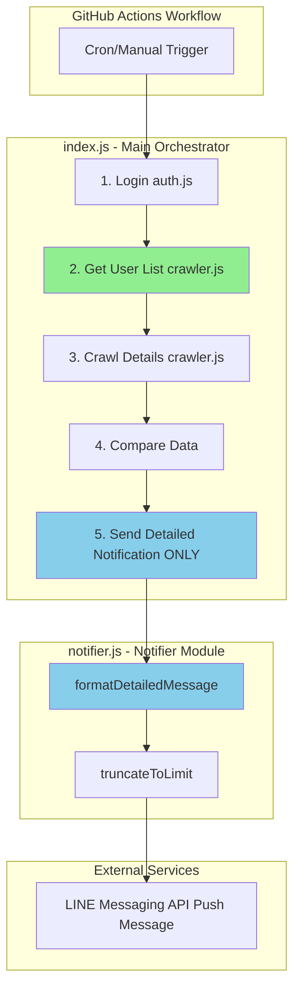
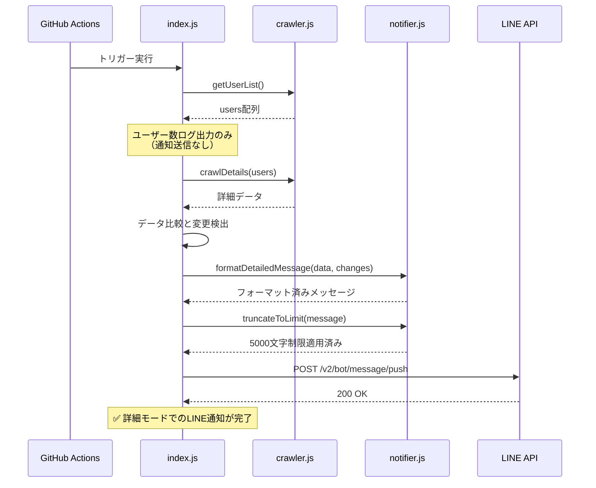

# Technical Design Document

## Overview

この機能は、スマイルゼミクローラーシステムにおけるLINE通知の重複を解消し、ユーザーエクスペリエンスを向上させます。現在、1回のクローリング実行で2つの異なるLINE通知（ユーザー一覧通知と詳細データ通知）が送信されていますが、詳細データ通知にはユーザー名が既に含まれているため、最初のユーザー一覧通知は冗長です。

**Purpose**: ユーザー一覧通知を削除し、詳細データ通知のみを送信することで、通知の重複を排除し、システムの簡潔性と保守性を向上させます。

**Users**: GitHub Actionsで自動実行されるスマイルゼミクローラーのLINE通知受信者（保護者ユーザー）が、1回の実行につき1つの統合された通知を受け取ります。

**Impact**: 現在の2回通知送信フローを1回に削減し、`sendUserListNotification`と`formatUserListMessage`関数を削除してコードベースを簡素化します。

### Goals

- ユーザー一覧通知の完全削除により、通知重複を解消
- 詳細データ通知の機能と情報完全性を維持
- 不要なコード（関数、ログ、ドキュメント）の削除による保守性向上
- 既存のエラーハンドリング、LINE API統合、環境変数管理の維持

### Non-Goals

- 詳細データ通知のフォーマット変更や機能追加
- LINE Messaging APIエンドポイントの変更
- 新しい通知タイプの追加
- 通知スケジュール（GitHub Actions cron）の変更
- ユーザー一覧データ取得処理（`getUserList`）の削除（内部処理として維持）
- 詳細通知のリトライロジック追加（既存の技術的負債として別仕様で対応）

## Architecture

> 詳細な発見ノートは`research.md`を参照。設計判断と契約はこのドキュメントに集約されています。

### Existing Architecture Analysis

**現在のアーキテクチャパターンと制約**:
- **通知フロー**: ログイン → ユーザー一覧取得 → **ユーザー一覧通知** → 詳細データクローリング → **詳細データ通知**
- **LINE API統合**: Push Message API (`https://api.line.me/v2/bot/message/push`)
- **エラーハンドリング**: `errors`配列への追加、ログ出力、処理継続パターン
- **環境変数**: `LINE_CHANNEL_ACCESS_TOKEN`, `LINE_USER_ID`
- **メッセージ制限**: 5000文字（`truncateToLimit`関数）

**維持すべき既存ドメイン境界**:
- 認証モジュール (`auth.js`) - ログイン処理
- クローラーモジュール (`crawler.js`) - データ抽出
- 通知モジュール (`notifier.js`) - LINE通知送信とフォーマット
- メインエントリーポイント (`index.js`) - ワークフローオーケストレーション

**維持すべき統合ポイント**:
- GitHub Secrets → 環境変数 → LINE API認証
- Playwright → DOM操作 → データ抽出
- データ比較 → 変更検出 → 通知トリガー

**対処または回避する技術的負債**:
- **既存**: 詳細通知のリトライロジック欠如（直接fetch実装）
- **対応**: スコープ外（`research.md`に記録、将来の改善タスクとして推奨）

### Architecture Pattern & Boundary Map

**Architecture Integration**:
- **選択パターン**: 単一責任原則に基づく機能削除（ユーザー一覧通知の除去）
- **選択理由**: YAGNIに従い、未使用で冗長な機能を削除してコード簡素化
- **ドメイン/機能境界**:
  - 通知モジュール (`notifier.js`) から`sendUserListNotification`と`formatUserListMessage`削除
  - メインワークフロー (`index.js`) から通知呼び出しブロック削除
  - データ取得処理 (`getUserList`) は維持（後続クローリングで使用）
- **既存パターン保持**:
  - エラーハンドリング: `errors`配列への追加とログ出力
  - ログパターン: 絵文字付き構造化ログ（console.log/error/warn）
  - 環境変数管理: GitHub Secretsからの設定取得
- **新規コンポーネント**: なし（既存コンポーネントの削除のみ）
- **ステアリングコンプライアンス**:
  - 単一責任原則: 詳細データ通知のみに責務を集中
  - YAGNI: 未使用機能の削除
  - エラー境界: 各モジュールでのエラーハンドリング維持



**主要な変更点**:
- **削除**: ユーザー一覧通知フロー（`GetUserList` → `SendUserListNotification` → `LINE API`）
- **維持**: ユーザー一覧取得（`GetUserList`）- 後続のクローリング処理で使用
- **維持**: 詳細データ通知フロー（`SendNotification` → `FormatDetailed` → `LINE API`）

### Technology Stack

| Layer | Choice / Version | Role in Feature | Notes |
|-------|------------------|-----------------|-------|
| Runtime | Node.js (GitHub Actions環境) | JavaScript実行環境 | 既存環境、変更なし |
| Automation | Playwright | ブラウザ自動化（データ取得に使用） | ユーザー一覧取得とクローリングで使用、変更なし |
| Messaging | LINE Messaging API (Push Message API) | 詳細データ通知送信 | `https://api.line.me/v2/bot/message/push`、統合維持 |
| Infrastructure | GitHub Actions (Ubuntu latest runner) | ワークフロー実行基盤 | 変更なし |

**技術スタックの整合性**:
- 既存のNode.js + Playwright + LINE APIスタックを維持
- 新規依存関係の追加なし
- 環境変数とGitHub Secrets統合の変更なし

## System Flows

### 通知フロー（変更後）



**フローレベルの判断**:
- **ユーザー一覧取得後**: ログ出力のみ、通知送信を削除
- **詳細データ取得後**: 既存の通知フローを維持
- **エラー時**: `errors`配列への追加とログ出力、処理は継続（既存パターン維持）

## Requirements Traceability

| Requirement | Summary | Components | Interfaces | Flows |
|-------------|---------|------------|------------|-------|
| 1.1 | クローリング完了時、詳細データ通知のみ送信 | `index.js` (main flow) | LINE API Push Message | 通知フロー |
| 1.2 | `sendUserListNotification`呼び出しを実行しない | `index.js` (削除) | - | - |
| 1.3 | ログに1回の通知送信記録のみ | `index.js` (logging) | - | 通知フロー |
| 1.4 | `src/index.js`の100-114行目削除 | `index.js` (code removal) | - | - |
| 1.5 | エラー時も1回のみ通知 | `index.js` (error handling) | - | 通知フロー |
| 2.1 | 詳細データ通知にユーザー名、学習時間、ミッション、点数変化含む | `notifier.js` (`formatDetailedMessage`) | Service Interface | 通知フロー |
| 2.2 | `formatDetailedMessage`使用 | `notifier.js`, `index.js` | Service Interface | 通知フロー |
| 2.3 | 既存フォーマット維持 | `notifier.js` (`formatDetailedMessage`) | Service Interface | 通知フロー |
| 2.4 | ミッション変化情報表示 | `notifier.js` (`formatDetailedMessage`) | Service Interface | 通知フロー |
| 2.5 | 複数ユーザーデータのセクション分け | `notifier.js` (`formatDetailedMessage`) | Service Interface | 通知フロー |
| 3.1 | `sendUserListNotification`呼び出し削除 | `index.js` (code removal) | - | - |
| 3.2 | `sendUserListNotification`関数削除 | `notifier.js` (function removal) | - | - |
| 3.3 | `formatUserListMessage`関数削除 | `notifier.js` (function removal) | - | - |
| 3.4 | コメント・ドキュメント更新 | `docs/API_NOTIFIER.md` | - | - |
| 3.5 | エラーハンドリング維持 | `index.js` (error handling) | - | 通知フロー |
| 4.1 | ユーザー一覧取得完了時のログ出力（通知なし） | `index.js` (logging) | - | - |
| 4.2 | 詳細データ通知送信前のログ | `index.js` (logging) | - | 通知フロー |
| 4.3 | 通知成功時のログ | `index.js` (logging) | - | 通知フロー |
| 4.4 | 通知失敗時のログ | `index.js` (logging) | - | 通知フロー |
| 4.5 | GitHub Actionsログで確認可能 | `index.js` (console output) | - | - |
| 5.1 | LINE Messaging API統合維持 | `index.js` (LINE API call) | API Contract | 通知フロー |
| 5.2 | データ取得フロー変更なし | `index.js`, `crawler.js` | - | - |
| 5.3 | 環境変数使用継続 | `index.js` (config) | - | - |
| 5.4 | 5000文字制限遵守 | `notifier.js` (`truncateToLimit`) | Service Interface | 通知フロー |
| 5.5 | リトライロジック維持 | `index.js` (注: 詳細通知にはリトライなし) | - | 通知フロー |
| 5.6 | 通知1回のみ送信の検証可能性 | Test Strategy | - | - |

## Components and Interfaces

### Component Summary

| Component | Domain/Layer | Intent | Req Coverage | Key Dependencies (Criticality) | Contracts |
|-----------|--------------|--------|--------------|--------------------------------|-----------|
| `index.js` (Main Orchestrator) | Workflow Orchestration | クローリングワークフロー全体の調整、通知送信ブロック削除 | 1.1-1.5, 3.1, 4.1-4.5, 5.1-5.3 | `crawler.js` (P0), `notifier.js` (P0), LINE API (P0) | - |
| `notifier.js` (Notifier Module) | Notification Formatting | 詳細データ通知のフォーマット、不要関数削除 | 2.1-2.5, 3.2-3.3, 5.4 | なし | Service |
| `docs/API_NOTIFIER.md` (Documentation) | Documentation | API仕様ドキュメント、削除関数の記述削除 | 3.4 | なし | - |

### Workflow Orchestration

#### index.js (Main Orchestrator)

| Field | Detail |
|-------|--------|
| Intent | クローリングワークフローを調整し、ユーザー一覧通知ブロックを削除、詳細データ通知のみを送信 |
| Requirements | 1.1, 1.2, 1.3, 1.4, 1.5, 3.1, 4.1, 4.2, 4.3, 4.4, 4.5, 5.1, 5.2, 5.3 |

**Responsibilities & Constraints**:
- ユーザー一覧取得後、ログ出力のみ実施（通知送信を削除）
- 詳細データ通知の既存実装を維持（フォーマット、文字数制限、LINE API呼び出し）
- エラーハンドリングパターン維持（`errors`配列、ログ出力、処理継続）
- 環境変数からの設定取得を維持（`LINE_CHANNEL_ACCESS_TOKEN`, `LINE_USER_ID`）

**Dependencies**:
- Inbound: GitHub Actions Trigger — ワークフロー開始 (P0)
- Outbound: `crawler.js` (`getUserList`, `crawlDetails`) — データ取得 (P0)
- Outbound: `notifier.js` (`formatDetailedMessage`, `truncateToLimit`) — 通知フォーマット (P0)
- External: LINE Messaging API (`/v2/bot/message/push`) — 通知送信 (P0)

**Contracts**: API [x]

##### API Contract

| Method | Endpoint | Request | Response | Errors |
|--------|----------|---------|----------|--------|
| POST | `https://api.line.me/v2/bot/message/push` | `{to: string, messages: [{type: 'text', text: string}]}` | `200 OK` | `400 Bad Request`, `401 Unauthorized`, `500 Internal Server Error` |

**Request Headers**:
- `Content-Type: application/json`
- `Authorization: Bearer ${LINE_CHANNEL_ACCESS_TOKEN}`

**Request Body**:
```typescript
interface PushMessageRequest {
  to: string;  // LINE_USER_ID
  messages: Array<{
    type: 'text';
    text: string;  // 5000文字以内
  }>;
}
```

**Implementation Notes**:
- **Integration**:
  - 既存のLINE API統合を維持（fetch API直接使用）
  - 環境変数`LINE_CHANNEL_ACCESS_TOKEN`と`LINE_USER_ID`使用
  - リトライロジックなし（既存の技術的負債、スコープ外）
- **Validation**:
  - メッセージ長制限: `truncateToLimit`で5000文字に制限
  - 環境変数存在確認（起動時にチェック）
- **Risks**:
  - 詳細通知のリトライロジック欠如は既存の技術的負債として記録（`research.md`）
  - ユーザー一覧通知のリトライロジック削除による影響なし（通知自体を削除）

**Code Removal**:
- **削除対象**: `src/index.js:100-114`
  ```javascript
  // 削除: ユーザー一覧をLINEに通知
  console.log('📤 ユーザー一覧をLINEに通知しています...');
  const userListNotifyResult = await sendUserListNotification(
    users,
    config.LINE_CHANNEL_ACCESS_TOKEN,
    config.LINE_USER_ID
  );

  if (userListNotifyResult.success) {
    console.log('✅ ユーザー一覧のLINE通知が完了しました');
  } else {
    console.error('❌ ユーザー一覧のLINE通知に失敗しました:', userListNotifyResult.error);
    errors.push(userListNotifyResult.error);
    // 通知失敗してもクローリングは続行
  }
  ```
- **維持**: `getUserList`呼び出しとユーザー数ログ（line 92-99, 115-119）
- **維持**: 詳細データ通知実装（line 234-276）

### Notification Formatting

#### notifier.js (Notifier Module)

| Field | Detail |
|-------|--------|
| Intent | 詳細データ通知のフォーマットを提供、ユーザー一覧通知関連関数を削除 |
| Requirements | 2.1, 2.2, 2.3, 2.4, 2.5, 3.2, 3.3, 5.4 |

**Responsibilities & Constraints**:
- `formatDetailedMessage`: 詳細データをLINE通知用メッセージにフォーマット（維持）
- `truncateToLimit`: メッセージを5000文字に制限（維持）
- `sendUserListNotification`: ユーザー一覧通知送信（削除）
- `formatUserListMessage`: ユーザー一覧メッセージフォーマット（削除）

**Dependencies**:
- Inbound: `index.js` — 詳細データフォーマット要求 (P0)
- Outbound: なし

**Contracts**: Service [x]

##### Service Interface

```typescript
// 維持: 詳細データフォーマット
interface NotifierService {
  formatDetailedMessage(
    userData: Array<UserData>,
    missionChanges: MissionChanges | null
  ): string;

  truncateToLimit(message: string): string;
}

interface UserData {
  userName: string;
  missionCount: number;
  date: string;
  studyTime: { hours: number; minutes: number };
  totalScore: number;
  missions: Array<Mission>;
}

interface Mission {
  name: string;
  score: number;
  completed: boolean;
}

interface MissionChanges {
  // ミッション変化情報の型定義（既存実装に準拠）
  [key: string]: {
    new?: boolean;
    scoreChange?: number;
  };
}
```

**削除対象インターフェース**:
```typescript
// 削除: ユーザー一覧通知関連
interface UserListNotificationService {
  sendUserListNotification(
    users: Array<{ name: string; index: number }>,
    accessToken: string,
    userId: string,
    options?: { maxRetries?: number; retryDelay?: number }
  ): Promise<{ success: boolean; error?: string }>;

  formatUserListMessage(
    users: Array<{ name: string; index: number }>
  ): string;
}
```

**Preconditions**:
- `formatDetailedMessage`: `userData`は空でない配列
- `truncateToLimit`: `message`は文字列

**Postconditions**:
- `formatDetailedMessage`: フォーマット済みメッセージ文字列を返す
- `truncateToLimit`: 5000文字以内のメッセージを返す

**Invariants**:
- メッセージフォーマットは既存パターン（日付、学習時間、ミッション一覧、絵文字）を維持
- ミッション変化アイコン（NEW ✨、📈 上昇、📉 下降）を継続表示
- 複数ユーザーの場合、セクション分けして表示

**Implementation Notes**:
- **Integration**: 既存の`formatDetailedMessage`と`truncateToLimit`は変更なし
- **Validation**: 入力データ検証は呼び出し元（`index.js`）で実施
- **Risks**: なし

**Code Removal**:
- **削除対象**: `src/notifier.js:243-332` (`sendUserListNotification`関数)
- **削除対象**: `src/notifier.js:340-348` (`formatUserListMessage`関数)
- **維持**: `formatDetailedMessage`, `truncateToLimit`, その他の既存関数

### Documentation

#### docs/API_NOTIFIER.md

| Field | Detail |
|-------|--------|
| Intent | `notifier.js`のAPI仕様ドキュメントから削除関数の記述を削除 |
| Requirements | 3.4 |

**Implementation Notes**:
- **Integration**: `sendUserListNotification`と`formatUserListMessage`の仕様セクション削除
- **Validation**: ドキュメントの一貫性確認（残存する関数のみ記載）
- **Risks**: なし

## Data Models

このフェーズでは既存のデータモデルを変更せず、通知フローのみを修正します。

### Domain Model

**変更なし**: 既存のドメインモデル（User, Mission, StudyData）は維持

### Logical Data Model

**変更なし**: データ構造、永続化、比較ロジックは変更なし

### Data Contracts & Integration

**LINE API Request Schema** (維持):
```typescript
interface PushMessageRequest {
  to: string;  // LINE_USER_ID
  messages: Array<{
    type: 'text';
    text: string;  // 5000文字以内
  }>;
}
```

**Message Format** (維持):
- 詳細データ通知: ユーザー名、日付、学習時間、ミッション一覧、点数変化
- フォーマット関数: `formatDetailedMessage` (変更なし)
- 文字数制限: `truncateToLimit` (変更なし)

## Error Handling

### Error Strategy

既存のエラーハンドリングパターンを維持します。

**エラー戦略**:
- **収集**: `errors`配列にエラーメッセージを追加
- **ログ**: `console.error`でエラー詳細を出力
- **継続**: エラー発生時も後続処理を継続（フェイルセーフ設計）
- **通知**: 最終的にエラーがあればLINE通知（既存実装）

### Error Categories and Responses

**User Errors (4xx)**:
- `401 Unauthorized`: LINE API認証エラー → GitHub Secretsの設定確認が必要（ログ出力）
- `400 Bad Request`: リクエスト形式エラー → ログ出力、処理継続

**System Errors (5xx)**:
- `500 Internal Server Error`: LINE APIサーバーエラー → ログ出力、処理継続（リトライなし）
- Network Timeout: ネットワークエラー → catch節でエラー捕捉、ログ出力

**Business Logic Errors**:
- ユーザー一覧取得失敗: 警告ログ、処理継続
- データ比較失敗: エラーログ、処理継続

**変更点**:
- ユーザー一覧通知失敗のエラーハンドリングを削除（通知自体を削除）
- その他のエラーハンドリングは維持

### Monitoring

**ログ出力** (維持):
- GitHub Actionsワークフローログで全ログを確認可能
- 構造化ログ: 絵文字付き段階表示（✅ 成功、❌ エラー、⚠️ 警告）
- 認証情報マスキング: GitHub Actionsの自動マスキング機能

**変更点**:
- ユーザー一覧通知関連ログの削除:
  - "📤 ユーザー一覧をLINEに通知しています..."
  - "✅ ユーザー一覧のLINE通知が完了しました"
  - "❌ ユーザー一覧のLINE通知に失敗しました"
- 維持: ユーザー一覧取得ログ（"✅ ユーザー一覧の取得が完了しました（N名）"）

## Testing Strategy

### Unit Tests

1. **`notifier.js`関数存在確認**:
   - `formatDetailedMessage`が存在し、正しく動作することを確認
   - `truncateToLimit`が5000文字制限を適用することを確認
   - `sendUserListNotification`と`formatUserListMessage`が存在しないことを確認

2. **メッセージフォーマット維持**:
   - `formatDetailedMessage`の出力形式が既存フォーマットと一致することを確認
   - ミッション変化アイコン（✨、📈、📉）が正しく表示されることを確認
   - 複数ユーザーのセクション分けが正しく機能することを確認

3. **文字数制限**:
   - `truncateToLimit`が5000文字を超えるメッセージを正しく切り捨てることを確認

### Integration Tests

1. **ワークフロー実行とLINE通知**:
   - GitHub Actionsワークフロー実行時、LINE通知が1回のみ送信されることを確認
   - 詳細データ通知の内容（ユーザー名、学習時間、ミッション情報）が正しいことを確認

2. **エラーハンドリング**:
   - LINE API認証エラー時、適切なログが出力され、処理が継続することを確認
   - ユーザー一覧取得失敗時、警告ログが出力され、後続処理が継続することを確認

3. **ログ出力**:
   - ユーザー一覧取得完了ログが出力されることを確認（通知送信ログは出力されないことを確認）
   - 詳細データ通知の送信前、成功、失敗ログが正しく出力されることを確認

### E2E/UI Tests

1. **GitHub Actionsワークフロー実行**:
   - 手動トリガー（`workflow_dispatch`）でワークフロー実行
   - LINE通知が1回のみ受信されることを確認
   - 通知内容にユーザー名、学習データ、ミッション情報が含まれることを確認

2. **環境変数検証**:
   - `LINE_CHANNEL_ACCESS_TOKEN`と`LINE_USER_ID`が正しく使用されることを確認

### Manual Test Checklist

1. GitHub Actionsワークフローを手動トリガー実行
2. LINEで通知を1回のみ受信することを確認
3. 通知内容に以下が含まれることを確認:
   - ユーザー名
   - 日付
   - 学習時間
   - ミッション一覧と点数
   - ミッション変化アイコン（✨、📈、📉）
4. GitHub Actionsログで以下を確認:
   - "✅ ユーザー一覧の取得が完了しました（N名）" が表示
   - "📤 ユーザー一覧をLINEに通知しています..." が**表示されない**
   - "✅ 詳細モードでのLINE通知が完了しました" が表示

## Security Considerations

**変更なし**: セキュリティ関連の既存実装を維持

- **認証情報管理**: GitHub Secretsに`LINE_CHANNEL_ACCESS_TOKEN`と`LINE_USER_ID`を保存（変更なし）
- **ログマスキング**: GitHub Actionsの自動マスキング機能（変更なし）
- **HTTPS通信**: LINE API通信はHTTPSのみ（変更なし）
- **環境変数検証**: 起動時に必須環境変数の存在確認（変更なし）

**削除による影響**: ユーザー一覧通知の削除により、認証トークンの使用回数が1回減少（セキュリティリスク低減）

## Performance & Scalability

**パフォーマンス改善**:
- LINE API呼び出し回数: 2回 → 1回（50%削減）
- ネットワーク往復時間: 削減（ユーザー一覧通知の送信時間削除）
- コード実行時間: わずかに削減（不要な関数呼び出しとエラーハンドリング削除）

**スケーラビリティ**: 変更なし（GitHub Actionsの実行回数とLINE APIレート制限は既存の制約のまま）

## Migration Strategy

**マイグレーション不要**: データスキーマやストレージ変更なし、コード削除のみ

**デプロイ手順**:
1. `src/index.js`からユーザー一覧通知ブロック削除（line 100-114）
2. `src/notifier.js`から`sendUserListNotification`と`formatUserListMessage`削除
3. `docs/API_NOTIFIER.md`から削除関数のドキュメント削除
4. コミットとプッシュ
5. GitHub Actionsワークフローの手動実行でテスト
6. LINE通知が1回のみ送信されることを確認

**ロールバック手順**:
- Git履歴から削除前のコミットに`git revert`
- または、削除した関数とコードブロックを再追加

**検証チェックポイント**:
- LINE通知が1回のみ送信される
- 通知内容にユーザー名、学習データ、ミッション情報が含まれる
- エラーハンドリングが正しく機能する
- ログ出力が適切（ユーザー一覧取得ログは維持、通知送信ログは削除）
