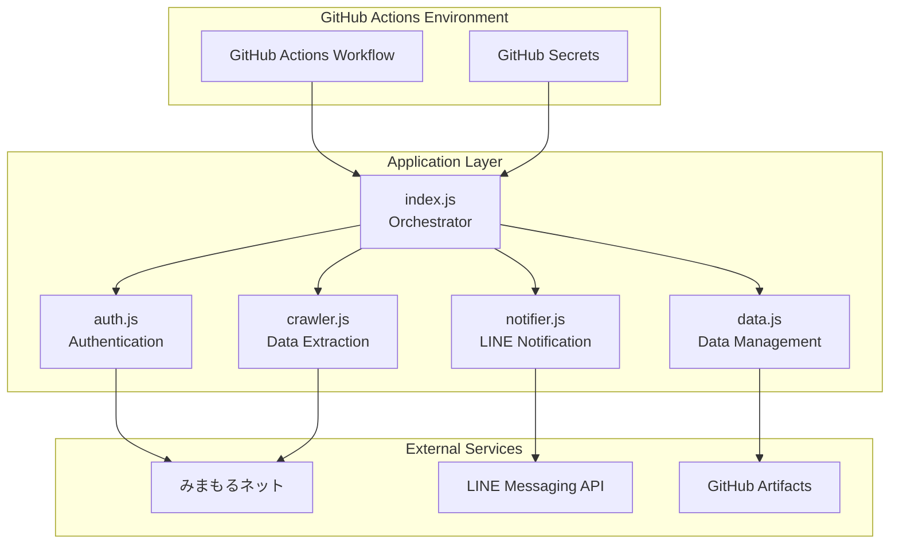
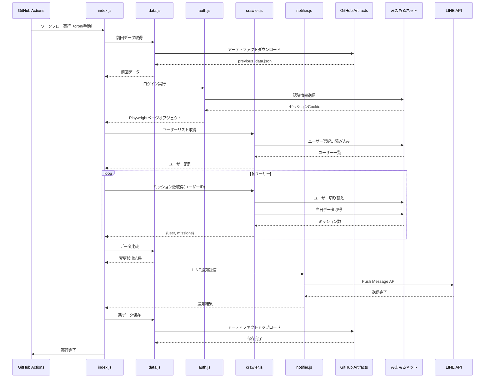
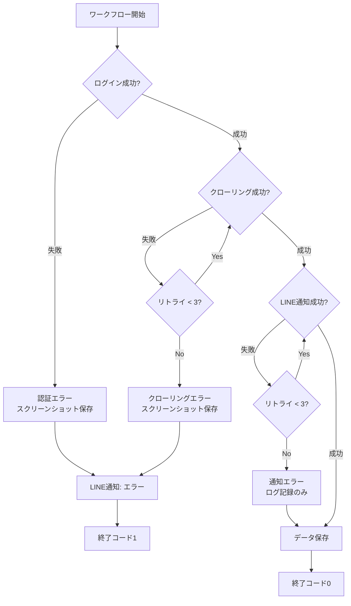
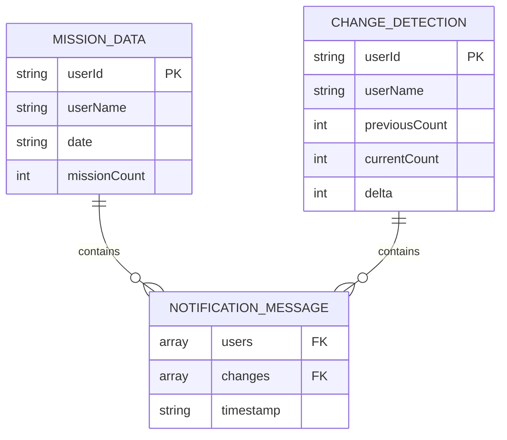
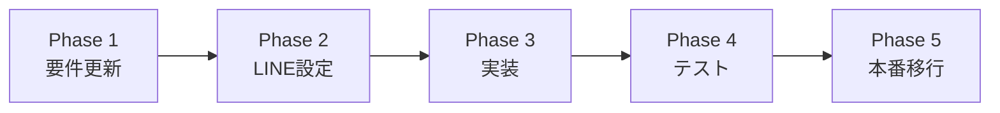

# 技術設計書

## Overview

本機能は、スマイルゼミ「みまもるネット」サイトから子供の学習進捗情報を自動的に収集し、保護者にLINE通知を送信するGitHub Actionsワークフローを提供します。保護者は手動チェックの負担なく、毎日18時（JST）に子供の学習状況をリアルタイムで確認できます。

**Purpose**: 保護者が複数の子供の学習進捗を自動監視し、LINE経由で即座に通知を受け取る仕組みを実現します。

**Users**: 保護者（スマイルゼミ契約者）がこのワークフローを設定し、自動実行により学習状況を把握します。

**Impact**: 手動ログイン・確認作業を完全自動化し、学習進捗の可視化を即時化します。

### Goals
- みまもるネットへの自動ログインと複数ユーザー情報取得
- 当日のミッション完了数を全ユーザー分収集
- LINE Messaging API経由での通知送信
- 毎日18時（JST）自動実行と手動トリガー対応
- Docker環境でのローカルテスト実行

### Non-Goals
- 過去データの履歴分析機能（当日データのみ取得）
- リアルタイム監視（1日1回の定期実行のみ）
- Webダッシュボード提供（LINE通知のみ）
- 複数保護者アカウント管理（単一アカウント前提）

## Architecture

### Architecture Pattern & Boundary Map

**選定パターン**: Modular Monolith（機能別モジュール分割）

**Domain/Feature Boundaries**:
- **Authentication**: ログイン処理の責務（auth.js）
- **Crawling**: データ取得とDOM操作の責務（crawler.js）
- **Notification**: LINE通知送信の責務（notifier.js）
- **Orchestration**: 全体フロー制御の責務（index.js）
- **Data Management**: データ保存・比較の責務（data.js）

**Steering Compliance**:
- 単一責任原則: 各モジュールが1つの機能に集中
- 明確な境界: モジュール間のインターフェース明確化
- エラー境界: 各モジュールで独立したエラーハンドリング



### Technology Stack

| Layer | Choice / Version | Role in Feature | Notes |
|-------|------------------|-----------------|-------|
| Runtime | Node.js 24.x | JavaScript実行環境 | LTS、2026年4月までサポート |
| Automation | GitHub Actions | CI/CDワークフロー実行基盤 | cron + workflow_dispatch |
| Browser | Playwright 1.40+ with Chromium | ブラウザ自動操作 | ヘッドレス実行、スクリーンショット |
| Notification | LINE Messaging API | 通知送信 | LINE Notify API後継（研究ドキュメント参照） |
| Storage | GitHub Actions Artifacts | 前回実行データ保存 | 90日保持、変更検出用 |
| Local Testing | Docker with Playwright image | ローカル実行環境 | 本番環境と同一コードベース |

**Technology Rationale** (詳細は research.md 参照):
- **Node.js 24**: Node 20 EOL対応、長期サポート保証
- **Playwright**: GitHub Actions実績豊富、安定したヘッドレス動作
- **LINE Messaging API**: LINE Notify終了に伴う公式推奨移行先
- **GitHub Artifacts**: 追加インフラ不要、統合容易

## System Flows

### 全体フロー



### エラーフロー



**フロー決定事項**:
- 認証失敗は即座に終了（リトライ不可、認証情報確認必要）
- クローリング失敗は最大3回リトライ（ネットワーク一時障害対応）
- LINE通知失敗でもデータ保存継続（通知はベストエフォート）

## Requirements Traceability

| Requirement | Summary | Components | Interfaces | Flows |
|-------------|---------|------------|------------|-------|
| 1.1-1.6 | GitHub Secrets統合 | index.js, auth.js, notifier.js | 環境変数API | 全体フロー初期化 |
| 2.1-2.7 | ログイン機能 | auth.js | AuthService | 認証フロー |
| 3.1-3.9 | ミッション数取得 | crawler.js | CrawlerService | データ取得フロー |
| 8.1-8.10 | 複数ユーザー対応 | crawler.js | CrawlerService | ユーザーループ処理 |
| 4.1-4.10 | LINE通知 | notifier.js | NotificationService | 通知フロー |
| 5.1-5.9 | GitHub Actionsワークフロー | .github/workflows/crawler.yml | Workflow Config | ワークフロー実行 |
| 6.1-6.10 | Docker環境テスト | Dockerfile, docker-compose.yml | Container Config | ローカル実行 |
| 7.1-7.7 | エラーハンドリング | 全モジュール | ErrorHandling | エラーフロー |
| 9.1-9.9 | セキュリティ | auth.js, notifier.js | SecretManagement | 認証・通知 |

## Components and Interfaces

### Component Summary

| Component | Domain/Layer | Intent | Req Coverage | Key Dependencies (P0/P1) | Contracts |
|-----------|--------------|--------|--------------|--------------------------|-----------|
| index.js | Orchestration | 全体フロー制御 | 1, 5 | Auth (P0), Crawler (P0), Notifier (P0), Data (P1) | Service |
| auth.js | Authentication | みまもるネット認証 | 2, 9 | Playwright (P0), みまもるネット (P0) | Service |
| crawler.js | Data Extraction | ユーザーデータ取得 | 3, 8 | Playwright (P0), みまもるネット (P0) | Service |
| notifier.js | Notification | LINE通知送信 | 4, 9 | LINE Messaging API (P0) | Service, API |
| data.js | Data Management | データ保存・比較 | 3, 4 | GitHub Artifacts API (P1) | Service |
| crawler.yml | Workflow | GitHub Actions設定 | 5, 6 | GitHub Actions (P0) | Workflow |
| Dockerfile | Container | Docker環境定義 | 6 | Playwright Image (P0) | Container |

### Orchestration Layer

#### index.js

| Field | Detail |
|-------|--------|
| Intent | ワークフロー全体のオーケストレーション |
| Requirements | 1.1, 1.2, 1.3, 1.4, 5.4, 5.5 |

**Responsibilities & Constraints**
- 環境変数からシークレット取得とバリデーション
- 各モジュール（Auth, Crawler, Notifier, Data）の呼び出し順序制御
- エラーハンドリングと終了コード管理

**Dependencies**
- Outbound: auth.js — ログイン実行 (P0)
- Outbound: crawler.js — データ取得実行 (P0)
- Outbound: notifier.js — 通知送信実行 (P0)
- Outbound: data.js — データ管理実行 (P1)
- External: Playwright — ブラウザ初期化 (P0)

**Contracts**: Service [x]

##### Service Interface
```typescript
interface MainOrchestrator {
  execute(): Promise<Result<ExecutionSummary, OrchestratorError>>;
}

interface ExecutionSummary {
  success: boolean;
  usersProcessed: number;
  notificationSent: boolean;
  errors: string[];
}

type OrchestratorError =
  | { type: 'MISSING_SECRETS'; secrets: string[] }
  | { type: 'AUTH_FAILED'; reason: string }
  | { type: 'CRAWLER_FAILED'; reason: string }
  | { type: 'NOTIFICATION_FAILED'; reason: string };
```

- Preconditions: 必須環境変数設定済み（SMILEZEMI_USERNAME, SMILEZEMI_PASSWORD, LINE_CHANNEL_ACCESS_TOKEN, LINE_USER_ID）
- Postconditions: 全ユーザーデータ処理完了、通知送信完了、データ保存完了
- Invariants: エラー発生時も部分成功データを保存

**Implementation Notes**
- Integration: 環境変数バリデーション → Auth → Crawler（ユーザーループ） → Data比較 → Notifier → Data保存
- Validation: 起動時に全シークレットの存在確認、欠落時は即座に終了コード1
- Risks: 単一障害点（オーケストレーター障害で全体停止）

### Authentication Layer

#### auth.js

| Field | Detail |
|-------|--------|
| Intent | みまもるネットへの自動ログイン |
| Requirements | 2.1, 2.2, 2.3, 2.4, 2.5, 2.6, 2.7, 9.1, 9.4, 9.6, 9.7 |

**Responsibilities & Constraints**
- ログインページアクセスとフォーム入力
- 認証処理実行とセッションCookie取得
- ログイン成功/失敗の判定
- ログイン失敗時のスクリーンショット保存

**Dependencies**
- External: Playwright — ブラウザ操作 (P0)
- External: みまもるネット — 認証エンドポイント (P0)

**Contracts**: Service [x]

##### Service Interface
```typescript
interface AuthService {
  login(credentials: Credentials): Promise<Result<Page, AuthError>>;
}

interface Credentials {
  username: string;
  password: string;
}

interface Page {
  // Playwright Page object
  goto(url: string): Promise<void>;
  locator(selector: string): Locator;
  screenshot(options: ScreenshotOptions): Promise<Buffer>;
}

type AuthError =
  | { type: 'LOGIN_PAGE_LOAD_FAILED'; url: string }
  | { type: 'AUTHENTICATION_FAILED'; reason: string }
  | { type: 'TIMEOUT'; timeoutMs: number };
```

- Preconditions: 有効な認証情報、みまもるネットアクセス可能
- Postconditions: ログイン後ページオブジェクト返却、セッションCookie有効
- Invariants: 認証情報はログ出力しない（マスキング必須）

**Implementation Notes**
- Integration: Playwright起動 → ログインページ遷移 → フォーム入力 → ログインボタンクリック → ログイン後URL確認
- Validation: ログイン後URLが`/mimamoru-net/ui/login`以外であること確認
- Risks: DOM構造変更によるセレクタ無効化（スクリーンショット保存で調査可能）

### Data Extraction Layer

#### crawler.js

| Field | Detail |
|-------|--------|
| Intent | みまもるネットから学習データ抽出 |
| Requirements | 3.1, 3.2, 3.3, 3.4, 3.5, 3.6, 3.7, 3.8, 3.9, 8.1, 8.2, 8.3, 8.4, 8.5, 8.6, 8.7, 8.8, 8.9, 8.10 |

**Responsibilities & Constraints**
- ユーザー選択UIから全ユーザーリスト取得
- 各ユーザーへの切り替えとページ更新待機
- 当日日付の学習日特定とミッション数抽出
- DOM要素見つからない場合のエラーハンドリング

**Dependencies**
- Inbound: index.js — オーケストレーターからの呼び出し (P0)
- External: Playwright — ページ操作 (P0)
- External: みまもるネット — データソース (P0)

**Contracts**: Service [x]

##### Service Interface
```typescript
interface CrawlerService {
  getUserList(page: Page): Promise<Result<User[], CrawlerError>>;
  getMissionCount(page: Page, user: User): Promise<Result<MissionData, CrawlerError>>;
}

interface User {
  id: string;
  name: string;
}

interface MissionData {
  userId: string;
  userName: string;
  date: string; // ISO 8601 format
  missionCount: number;
}

type CrawlerError =
  | { type: 'USER_LIST_NOT_FOUND'; selector: string }
  | { type: 'USER_SWITCH_FAILED'; userId: string }
  | { type: 'MISSION_DATA_NOT_FOUND'; userId: string; date: string }
  | { type: 'TIMEOUT'; operation: string; timeoutMs: number };
```

- Preconditions: ログイン済みPageオブジェクト、学習状況ページアクセス可能
- Postconditions: 全ユーザーのミッションデータ取得完了
- Invariants: ユーザー切り替え失敗時も他ユーザー処理継続

**Implementation Notes**
- Integration: ユーザーリスト取得 → 各ユーザーループ（切り替え → ページ待機 → ミッション数抽出）
- Validation:
  - ユーザー選択UI要素存在確認（`waitForSelector`使用）
  - 当日日付フォーマット検証（`YYYY-MM-DD`形式）
  - ミッション数の数値パース検証
- Risks:
  - ユーザー切り替え後のページ更新タイミング（`waitForLoadState('networkidle')`使用）
  - 当日データ未表示時の処理（ミッション数0として記録）

### Notification Layer

#### notifier.js

| Field | Detail |
|-------|--------|
| Intent | LINE Messaging API経由での通知送信 |
| Requirements | 4.1, 4.2, 4.3, 4.4, 4.5, 4.6, 4.7, 4.8, 4.9, 4.10, 9.1, 9.4, 9.7 |

**Responsibilities & Constraints**
- LINE Messaging API認証（Channel Access Token）
- 通知メッセージ構築（全ユーザー情報 + 変更差分）
- Push Message API呼び出し
- 通知失敗時のリトライ処理

**Dependencies**
- Inbound: index.js — 通知送信要求 (P0)
- External: LINE Messaging API — 通知送信先 (P0)

**Contracts**: Service [x] / API [x]

##### Service Interface
```typescript
interface NotificationService {
  sendNotification(message: NotificationMessage): Promise<Result<void, NotificationError>>;
}

interface NotificationMessage {
  users: UserMissionSummary[];
  changes: ChangeDetection[];
  timestamp: string;
}

interface UserMissionSummary {
  userId: string;
  userName: string;
  missionCount: number;
}

interface ChangeDetection {
  userId: string;
  userName: string;
  previousCount: number;
  currentCount: number;
  delta: number;
}

type NotificationError =
  | { type: 'INVALID_TOKEN'; token: string }
  | { type: 'INVALID_USER_ID'; userId: string }
  | { type: 'MESSAGE_TOO_LONG'; length: number; maxLength: number }
  | { type: 'API_CALL_FAILED'; statusCode: number; response: string }
  | { type: 'RETRY_EXHAUSTED'; attempts: number };
```

##### API Contract

| Method | Endpoint | Request | Response | Errors |
|--------|----------|---------|----------|--------|
| POST | https://api.line.me/v2/bot/message/push | PushMessageRequest | 200 OK | 400, 401, 429, 500 |

**PushMessageRequest**:
```typescript
interface PushMessageRequest {
  to: string; // User ID or Group ID
  messages: Message[];
}

interface Message {
  type: 'text';
  text: string; // 最大5000文字
}
```

- Preconditions: 有効なChannel Access Token、有効なUser ID/Group ID
- Postconditions: LINE通知送信完了
- Invariants: 認証トークンはログ出力しない

**Implementation Notes**
- Integration: メッセージ構築 → API呼び出し → レスポンス検証 → リトライ処理
- Validation:
  - メッセージ長制限チェック（5000文字以内）
  - 1000文字超過時の重要情報優先表示
  - レスポンスステータスコード検証
- Risks:
  - API rate limit（リトライ間隔指数バックオフ）
  - User ID/Group ID誤設定（初回実行時エラー検出）

### Data Management Layer

#### data.js

| Field | Detail |
|-------|--------|
| Intent | データ保存・取得・比較 |
| Requirements | 3.6, 3.9, 4.6, 4.7 |

**Responsibilities & Constraints**
- GitHub Artifactsからの前回データダウンロード
- 新旧データ比較とユーザー別変更検出
- 新データのJSONシリアライズとアップロード

**Dependencies**
- Inbound: index.js — データ管理要求 (P0)
- External: GitHub Actions Artifacts API — データ永続化 (P1)

**Contracts**: Service [x]

##### Service Interface
```typescript
interface DataService {
  loadPreviousData(): Promise<Result<MissionData[], DataError>>;
  compareData(previous: MissionData[], current: MissionData[]): ChangeDetection[];
  saveCurrentData(data: MissionData[]): Promise<Result<void, DataError>>;
}

type DataError =
  | { type: 'ARTIFACT_NOT_FOUND'; artifactName: string }
  | { type: 'DOWNLOAD_FAILED'; reason: string }
  | { type: 'UPLOAD_FAILED'; reason: string }
  | { type: 'INVALID_JSON'; parseError: string };
```

- Preconditions: GitHub Actions実行環境、アーティファクトアクセス権限
- Postconditions: 前回データ取得完了、変更検出完了、新データ保存完了
- Invariants: データ保存失敗でもワークフロー継続（次回実行で比較不可）

**Implementation Notes**
- Integration: アーティファクトダウンロード → JSONパース → データ比較 → JSON生成 → アーティファクトアップロード
- Validation:
  - JSONスキーマ検証（MissionData型一致確認）
  - 日付フォーマット検証
- Risks:
  - 初回実行時アーティファクト未存在（空配列として処理）
  - 90日以降のアーティファクト削除（全ユーザー新規扱い）

### Workflow Layer

#### .github/workflows/crawler.yml

| Field | Detail |
|-------|--------|
| Intent | GitHub Actionsワークフロー定義 |
| Requirements | 5.1, 5.2, 5.3, 5.4, 5.5, 5.6, 5.7, 5.8, 5.9 |

**Workflow Configuration**:
```yaml
name: Smile Zemi Crawler
on:
  schedule:
    - cron: '0 9 * * *'  # UTC 9:00 = JST 18:00
  workflow_dispatch:

jobs:
  crawl:
    runs-on: ubuntu-latest
    timeout-minutes: 30
    steps:
      - uses: actions/checkout@v4
      - uses: actions/setup-node@v6
        with:
          node-version: '24'
          cache: 'npm'
      - run: npm ci
      - run: npx playwright install --with-deps chromium
      - run: node index.js
        env:
          SMILEZEMI_USERNAME: ${{ secrets.SMILEZEMI_USERNAME }}
          SMILEZEMI_PASSWORD: ${{ secrets.SMILEZEMI_PASSWORD }}
          LINE_CHANNEL_ACCESS_TOKEN: ${{ secrets.LINE_CHANNEL_ACCESS_TOKEN }}
          LINE_USER_ID: ${{ secrets.LINE_USER_ID }}
      - uses: actions/upload-artifact@v4
        if: always()
        with:
          name: screenshots
          path: screenshots/
      - uses: actions/upload-artifact@v4
        if: success()
        with:
          name: mission-data
          path: data/mission_data.json
```

**Implementation Notes**:
- Integration: Node.js環境セットアップ → 依存関係インストール → Playwrightインストール → スクリプト実行 → アーティファクト保存
- Validation: タイムアウト30分設定、成功時のみデータアーティファクト保存、常にスクリーンショット保存
- Risks: cron実行遅延（数分程度のずれ可能性）、ランナー環境の変更

### Container Layer

#### Dockerfile

| Field | Detail |
|-------|--------|
| Intent | Docker環境定義 |
| Requirements | 6.1, 6.2, 6.3, 6.4 |

**Container Configuration**:
```dockerfile
FROM mcr.microsoft.com/playwright:v1.40.0-jammy

WORKDIR /app

COPY package*.json ./
RUN npm ci

COPY . .

CMD ["node", "index.js"]
```

**docker-compose.yml**:
```yaml
version: '3.8'
services:
  crawler:
    build: .
    env_file:
      - .env
    volumes:
      - ./screenshots:/app/screenshots
      - ./data:/app/data
```

**Implementation Notes**:
- Integration: 公式Playwrightイメージ継承 → 依存関係インストール → アプリケーションコピー → 実行
- Validation: .envファイル必須、ボリュームマウントでデータ永続化
- Risks: Playwrightイメージバージョン更新（GitHub Actions環境と同期必要）

## Data Models

### Domain Model

**Aggregates**:
- **MissionDataAggregate**: ユーザーとその日のミッション数を集約
- **NotificationAggregate**: 通知メッセージと変更検出結果を集約

**Entities**:
- User: ユーザー識別情報
- MissionData: 日付付きミッションデータ

**Value Objects**:
- Credentials: 認証情報（不変）
- ChangeDetection: 変更差分（不変）

**Business Rules**:
- ミッション数は非負整数
- 日付は当日のみ（過去データ取得しない）
- ユーザー切り替え失敗時も他ユーザー処理継続

### Logical Data Model

**Structure Definition**:



**Consistency & Integrity**:
- Transaction Boundaries: 各ユーザーデータ取得は独立（ユーザーA失敗でもユーザーB処理継続）
- Temporal Aspects: タイムスタンプはISO 8601形式、JSTタイムゾーン

### Physical Data Model

**For Key-Value Store (GitHub Artifacts)**:

**mission_data.json Structure**:
```json
{
  "version": "1.0",
  "timestamp": "2025-12-25T18:00:00+09:00",
  "users": [
    {
      "userId": "user_001",
      "userName": "太郎",
      "date": "2025-12-25",
      "missionCount": 5
    }
  ]
}
```

- Key Design: アーティファクト名固定（`mission-data`）
- TTL: 90日（GitHub Artifacts自動削除）
- Compaction Strategy: 毎回上書き（履歴保持しない）

### Data Contracts & Integration

**API Data Transfer**:

**LINE Push Message Request**:
```json
{
  "to": "U1234567890abcdef1234567890abcdef",
  "messages": [
    {
      "type": "text",
      "text": "【学習進捗】2025-12-25\n\n太郎: 5ミッション\n花子: 3ミッション\n\n[変更]\n太郎: +2ミッション"
    }
  ]
}
```

**Artifact Data Schema**:
```typescript
interface ArtifactData {
  version: string;
  timestamp: string; // ISO 8601
  users: MissionData[];
}
```

**Schema Versioning Strategy**: version フィールドで管理、破壊的変更時はバージョン番号増加

**Cross-Service Data Management**: GitHub Artifacts ↔ Node.jsスクリプト間のJSON形式同期

## Error Handling

### Error Strategy

各エラーカテゴリに対して、具体的な回復メカニズムを定義します。

### Error Categories and Responses

**認証エラー（Authentication Errors）**:
- `LOGIN_PAGE_LOAD_FAILED`: ログインページアクセス失敗 → スクリーンショット保存 → LINE通知（エラー詳細） → 終了コード1
- `AUTHENTICATION_FAILED`: 認証失敗 → ログ記録 → LINE通知（認証情報確認要求） → 終了コード1
- **回復**: リトライ不可（認証情報確認が必要）

**クローリングエラー（Crawler Errors）**:
- `USER_LIST_NOT_FOUND`: ユーザーリストUI要素未検出 → リトライ（最大3回、5秒間隔） → スクリーンショット保存 → LINE通知
- `USER_SWITCH_FAILED`: ユーザー切り替え失敗 → 当該ユーザースキップ → 他ユーザー処理継続 → 最終的にエラーログ記録
- `MISSION_DATA_NOT_FOUND`: ミッションデータ未検出 → ミッション数0として記録 → 警告ログ出力
- **回復**: リトライ可能、部分失敗許容

**通知エラー（Notification Errors）**:
- `INVALID_TOKEN`: トークン無効 → ログ記録 → 終了コード1（通知不可でもデータ保存継続）
- `INVALID_USER_ID`: User ID無効 → ログ記録 → 終了コード1
- `MESSAGE_TOO_LONG`: メッセージ長超過 → 重要情報優先で1000文字に短縮 → 再送信
- `API_CALL_FAILED`: API呼び出し失敗 → リトライ（最大3回、指数バックオフ: 1s, 2s, 4s）
- **回復**: リトライ可能、通知失敗でもデータ保存継続

**データエラー（Data Errors）**:
- `ARTIFACT_NOT_FOUND`: アーティファクト未存在 → 空配列として処理（初回実行時正常）
- `DOWNLOAD_FAILED`: ダウンロード失敗 → ログ記録 → 空配列として処理 → 変更検出不可通知
- `UPLOAD_FAILED`: アップロード失敗 → ログ記録 → 警告通知 → 次回実行で比較不可
- **回復**: ベストエフォート、失敗でもワークフロー継続

**システムエラー（System Errors）**:
- `TIMEOUT`: タイムアウト → リトライまたはスキップ（操作種別により判断）
- `NETWORK_ERROR`: ネットワーク障害 → リトライ（最大3回） → スクリーンショット保存 → LINE通知
- **回復**: リトライ可能、最終的に失敗時は通知

### Monitoring

**Error Tracking**:
- GitHub Actionsログに全エラースタックトレース記録
- スクリーンショットをアーティファクトとして保存（保持期間90日）
- LINE通知でエラーサマリー送信

**Logging**:
- Log Level: ERROR（認証・通知失敗）、WARN（ユーザースキップ）、INFO（正常処理）
- Log Format: `[timestamp] [level] [module] message`
- Sensitive Data Masking: パスワード、トークンは`***`表示

**Health Monitoring**:
- ワークフロー成功/失敗ステータス（GitHub Actions UI）
- 終了コード: 0（成功）、1（失敗）
- アーティファクト存在確認（データ保存成功判定）

## Testing Strategy

### Unit Tests

**auth.js**:
1. `login()` 正常系: 有効な認証情報でログイン成功、Pageオブジェクト返却
2. `login()` 異常系: 認証失敗時AuthError返却
3. 環境変数マスキング: ログ出力に認証情報含まれない

**crawler.js**:
1. `getUserList()` 正常系: ユーザーリスト取得、User配列返却
2. `getMissionCount()` 正常系: 当日ミッション数取得、MissionData返却
3. `getMissionCount()` 異常系: データ未検出時ミッション数0返却
4. ユーザー切り替え失敗時のエラーハンドリング

**notifier.js**:
1. `sendNotification()` 正常系: LINE API呼び出し成功
2. `sendNotification()` 異常系: API失敗時リトライ処理実行
3. メッセージ長制限チェック: 1000文字超過時短縮処理
4. トークンマスキング: ログ出力にトークン含まれない

**data.js**:
1. `loadPreviousData()` 正常系: アーティファクト存在時データ取得
2. `loadPreviousData()` 初回実行: アーティファクト未存在時空配列返却
3. `compareData()`: 変更検出ロジック（増加、減少、変更なし）
4. `saveCurrentData()`: JSON生成とアップロード

### Integration Tests

**認証 → クローリングフロー**:
1. ログイン成功後、学習状況ページ遷移確認
2. ユーザーリスト取得とミッション数取得の連携
3. 複数ユーザーループ処理の正常動作

**クローリング → 通知フロー**:
1. データ取得完了後、LINE通知送信確認
2. 変更検出結果が通知メッセージに反映
3. エラー時の通知メッセージ内容確認

**データ管理フロー**:
1. アーティファクトダウンロード → 比較 → アップロードの一連処理
2. 初回実行時の空データ処理
3. データ保存失敗時のエラーハンドリング

**エンドツーエンドフロー**:
1. GitHub Actions環境での完全実行（手動トリガー）
2. Docker環境での完全実行（ローカル）
3. エラーリカバリーシナリオ（ネットワーク一時障害シミュレーション）

### E2E/UI Tests

**GitHub Actionsワークフロー**:
1. cron自動実行のトリガー確認（手動実行で代替テスト）
2. 環境変数からのシークレット取得確認
3. アーティファクト保存確認（スクリーンショット、データ）
4. 終了コード確認（成功時0、失敗時1）

**Docker環境**:
1. .envファイルからの環境変数読み込み確認
2. ボリュームマウントでのデータ永続化確認
3. GitHub Actions環境との動作一致確認

**みまもるネットUI操作**:
1. ログインフォーム入力とログイン成功確認
2. ユーザー選択ドロップダウン操作確認
3. 当日日付のミッション数表示要素取得確認
4. ユーザー切り替え後のページ更新待機確認

### Performance/Load Tests

**実行時間測定**:
1. ログイン処理: 5秒以内
2. ユーザー1人あたりのミッション数取得: 3秒以内
3. 全体実行時間（ユーザー5人想定）: 30秒以内
4. ワークフロー全体: 2分以内（Playwrightインストール含む）

**リソース使用量**:
1. メモリ使用量: 512MB以内（GitHub Actionsランナー制約）
2. ストレージ使用量: アーティファクト100KB以内
3. 同時実行: 1ワークフローのみ（競合条件なし）

## Security Considerations

### Threat Modeling

**攻撃ベクトル**:
1. 認証情報漏洩: GitHub Secretsからの漏洩、ログ出力への露出
2. セッションハイジャック: Cookie盗聴
3. データ改ざん: アーティファクトデータ不正変更
4. API トークン漏洩: LINE Channel Access Token露出

**セキュリティ制御**:
1. GitHub Secrets使用: 認証情報をコードに埋め込まない（9.1）
2. ログマスキング: 認証情報・トークンを自動マスキング（9.4）
3. HTTPS通信のみ: HTTP通信禁止（9.7）
4. .gitignore設定: .envファイルをバージョン管理から除外（9.3）
5. 暗号化アーティファクト: データをGitHubアーティファクトに暗号化保存（9.5）

### Authentication and Authorization

**GitHub Secrets管理**:
- 必須Secrets: `SMILEZEMI_USERNAME`, `SMILEZEMI_PASSWORD`, `LINE_CHANNEL_ACCESS_TOKEN`, `LINE_USER_ID`
- アクセス制御: リポジトリ管理者のみがSecrets設定可能
- ローテーション: 定期的なパスワード・トークン更新推奨

**LINE Messaging API認証**:
- Channel Access Token: 長期トークン使用（短期トークン更新不要）
- スコープ: Push Message送信のみ（最小権限の原則）

### Data Protection and Privacy

**個人情報取り扱い**:
- 取得データ: ユーザー名、ミッション数（学習進捗データ）
- データ最小化: 必要最小限のデータのみ取得（9.8）
- データ保持: 90日間（GitHub Artifacts保持期間）
- データ削除: アーティファクト自動削除

**通信セキュリティ**:
- TLS 1.2以上: 全通信をHTTPS経由で実行
- 証明書検証: Playwright/Node.jsデフォルト設定使用

**依存パッケージ管理**:
- 脆弱性スキャン: Dependabot自動有効化（9.9）
- 定期更新: npm audit実行とパッケージ更新

## Migration Strategy

### LINE Notify API → LINE Messaging API移行

**移行フェーズ**:



**Phase 1: 要件更新** ✅ 完了
- requirements.md更新: LINE_NOTIFY_TOKEN → LINE_CHANNEL_ACCESS_TOKEN
- LINE_CHANNEL_ID削除、LINE_USER_ID追加
- tech.md更新: Required Secrets、Key Libraries、技術選定理由
- 所要時間: 即座

**Phase 2: LINE Official Account設定**
- LINE Developers Console登録
- Messaging API Channel作成
- Channel Access Token取得
- User ID/Group ID取得（LINE公式アカウント友だち追加必要）
- 所要時間: 30分

**Phase 3: 実装**
- notifier.js実装: LINE Messaging API対応
- API エンドポイント変更: `https://notify-api.line.me/api/notify` → `https://api.line.me/v2/bot/message/push`
- リクエスト形式変更: form-data → JSON
- 所要時間: 2時間

**Phase 4: テスト**
- Docker環境でのエンドツーエンドテスト
- GitHub Actions環境での手動実行テスト
- 通知メッセージ内容確認
- 所要時間: 1時間

**Phase 5: 本番移行**
- GitHub Secrets更新
- 初回cron実行確認
- ロールバック手順: Secrets巻き戻し
- 所要時間: 15分

**Rollback Triggers**:
- LINE API認証失敗（401 Unauthorized）
- User ID無効エラー（400 Bad Request）
- 通知送信失敗率100%

**Validation Checkpoints**:
- Phase 2: Channel Access Token取得完了
- Phase 3: ローカルテストで通知成功
- Phase 4: Docker/GitHub Actions両環境でテスト成功
- Phase 5: 初回本番実行成功
